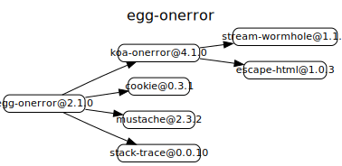
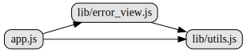

# egg-onerror

# 源码分析

## 项目结构

``` bash
├── agent.js
├── app.js - 入口文件，监听onerror，拦截上报logger。json型format格式，html型调用error_view渲染模板
├── config
|  └── config.default.js - 默认配置，挂载到config后取用
├── lib
|  ├── error_view.js - html型错误页内容，渲染模板，组装错误堆栈和app信息
|  ├── onerror_page.mustache - 默认模板
|  └── utils.js
```

## 外部模块依赖



koa-onerror[源码分析](https://github.com/FunnyLiu/onerror/tree/readsource)，和koa-error[源码分析](https://github.com/FunnyLiu/error/tree/readsource)使用try-catch的思路不同，这里采用hack了ctx.onerror方法的方式来处理异常。这样就可以处理 steams和and event的errors，并且提供了更加灵活的配置参数。

[stack-trace](https://github.com/felixge/node-stack-trace)是寻找V8函数调用堆栈的库。


## 内部模块依赖



## 逐个文件分析

### app.js

监听app对象上的error事件（该事件在egg源码中，重要位置会触发，比如[生命周期出错](https://github.com/FunnyLiu/egg-core/blob/readsource/lib/egg.js#L1110)）调用ctx.logger.error或app.logger.error来做异常上报。

然后基于koa-onerror模块[源码分析](https://github.com/FunnyLiu/onerror/tree/readsource)，传入参数，针对不同类型在不同环境不同处理。

如果是json类型，则format格式，如果是html，则通过error_view.js，渲染html挂载到ctx.body。


### error_view.js


根据配置中的模板路径，找到错误页模板，基于Mustache模板。

然后在toHTML()被调用后，对内容进行序列化，编译模板内容。

序列化数据过程中，调用堆栈是基于stack-trace模块。

